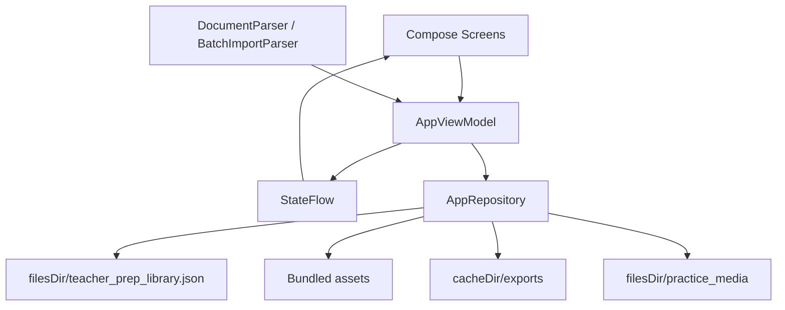

# 教招上岸 Android

面向教师招聘面试备考的原生 Android 应用。应用围绕“试讲、结构化问答、答题模板、练习复盘”四类高频备考场景组织内容，支持按学段、学科、教材版本管理题库，导入外部资料，记录练习过程，并将题库导出为可分享的 JSON 或 Markdown 文件。

## 核心功能

### 题库空间

- 按“学段 + 学科 + 教材版本”建立独立试讲题库，例如初中语文人教版、小学数学北师大版等。
- 结构化问答和答题模板使用共享题库，切换学科时仍可复用通用面试素材。
- 支持自定义学段、学科、教材版本、教材册别、单元、题材、结构化题型、模板类型和内容章节名称。
- 首次进入应用时通过题库选择页确定默认备考范围，后续可在设置中切换或扩展。

### 首页看板

- 汇总当前题库的试讲、结构化、模板数量和练习记录。
- 提供最近练习、收藏内容、随机抽取入口和快捷导航。
- 支持按标签保存随机抽取范围，避免每次重新配置筛选条件。

### 试讲题库

- 每条试讲记录包含标题、作者、教材、单元、课次、题材、重要程度、课程信息、试讲流程、板书图片和练习媒体。
- 支持搜索、按教材/单元/题材/重要程度筛选、收藏、批量删除和批量导出。
- 试讲详情分为课程信息、试讲流程、板书设计、练习记录等页面，默认打开页面可配置。
- 支持为试讲添加板书图片，并通过可视化内容编辑器维护分段内容。
- 支持记录试讲次数、最近练习时间，并自动写入练习日历。

### 结构化问答

- 结构化题目按题型分类，例如教育教学、应急应变、人际沟通、综合分析等。
- 每题可拆分为多个答题章节，适合维护“答题思路、参考答案、亮点表达”等内容。
- 支持重要程度、收藏、随机抽题、计时练习、练习记录和媒体复盘。
- 支持批量导入带编号和答案标记的题库文本。

### 答题模板

- 用于沉淀导入语、过渡语、评价语、万能答题框架等复用素材。
- 支持分类、搜索、收藏、练习记录、媒体附件和 Markdown 导出。
- 与结构化题库一样归入共享库，不依赖当前试讲题库范围。

### 导入与导出

- 支持导入 `.md`、`.txt`、`.docx`、`.pdf` 文档。
- Markdown 文档会按标题拆分章节；普通文本和 Word 文档会尝试按配置好的章节名拆分。
- 批量导入器可识别常见的“编号 + 答案/参考答案”格式，用于快速导入结构化题库或试讲资料。
- 支持导出完整备考库、当前题库、单条内容或批量内容。
- JSON 导出用于备份和迁移；Markdown 导出用于分享、打印或二次编辑。

### 练习与复盘

- 支持倒计时和正计时两种练习模式。
- 可配置默认试讲时长、默认结构化时长、结束前提醒和结束提醒。
- 每次练习会生成 `PracticeEvent`，用于首页统计和练习日历展示。
- 试讲、结构化、模板都可以挂载音频或视频复盘文件。
- 媒体文件保存在应用私有目录 `practice_media/`，删除题目或附件时会同步清理对应文件。
- 媒体附件支持自动编号和重命名，便于区分第几次练习。

### 个性化设置

- 支持五套主题色：珊瑚、天空、粉色、紫色、薄荷。
- 支持调整卡片透明度、Logo 缩放、界面密度和字体比例。
- 可配置列表筛选项是否显示，保持首页和题库页面清爽。
- 可配置试讲详情默认打开页面和练习提醒策略。

## 技术栈

- Kotlin
- Jetpack Compose
- Material 3
- AndroidX Lifecycle ViewModel + StateFlow
- Kotlin Serialization
- Coil Compose
- PDFBox Android
- Gradle Wrapper
- JUnit 4

## 架构概览

项目采用单 Activity + Compose + ViewModel + Repository 的本地优先架构。



### UI 层

`MainActivity` 负责初始化主题、加载状态、路由状态和 Android Activity Result 回调。页面全部由 Compose 实现，主要页面位于 `feature/`：

- `LibrarySelectionScreen.kt`：题库范围选择。
- `HomeScreen.kt`：首页看板、随机抽取和快捷入口。
- `TrialScreens.kt`：试讲列表与试讲详情。
- `PracticeScreens.kt`：结构化问答和模板库。
- `PracticeCalendarScreen.kt`：练习日历与历史记录。
- `ImportScreen.kt`：文档导入、批量解析和内容创建。
- `SettingsScreen.kt`：题库配置、计时提醒、显示偏好和筛选项设置。
- `TrialMediaSection.kt`：练习音视频附件展示、命名和删除。
- `VisualContentEditor.kt`：分段内容编辑器。

通用 UI 组件集中在 `ui/`：

- `Components.kt`：卡片、标题、筛选、计时器、Markdown 文本等通用组件。
- `RandomDrawDialog.kt`：多条件随机抽取弹窗。
- `PracticeHistory.kt`：练习历史展示辅助。
- `theme/Theme.kt`：主题色、透明度、字体比例和界面缩放。

### 状态层

`AppViewModel` 是界面和数据仓库之间的唯一状态入口。

- 暴露 `StateFlow<AppUiState>` 给 Compose 订阅。
- 通过 `update { ... }` 修改 `AppData`，随后异步保存到本地 JSON。
- 提供题库切换、偏好设置、增删改查、收藏、练习记录、媒体附件、导入导出等操作。
- 删除题目时会同步删除关联媒体文件和练习事件，避免本地垃圾数据堆积。

### 数据层

核心数据模型位于 `data/Models.kt`：

- `LibraryScope`：题库范围，包含学段、学科、教材版本。
- `ScopeConfig`：当前题库下的教材、单元、题材、题型、模板分类和章节配置。
- `TrialLesson`：试讲条目。
- `StructuredQuestion`：结构化问答条目。
- `AnswerTemplate`：答题模板。
- `PracticeMedia`：音频/视频复盘文件。
- `PracticeEvent`：练习事件。
- `AppPreferences`：用户偏好。
- `AppData`：完整备考库根对象。

`AppRepository` 负责持久化、迁移、导入导出和内置资源加载：

- 主数据文件：`filesDir/teacher_prep_library.json`。
- 保存策略：先写入临时文件，再替换正式文件。
- JSON 配置：`ignoreUnknownKeys = true`、`encodeDefaults = true`，兼容旧版本和新增字段。
- 当前 `schemaVersion` 为 17，旧数据会在 `migrate()` 中逐步迁移。
- 导出文件写入 `cacheDir/exports`，通过 `FileProvider` 分享给系统。
- 练习媒体放入 `filesDir/practice_media`，只允许删除该目录下的文件。

### 解析与内置数据

- `DocumentParser` 负责读取 `.txt`、`.md`、`.docx`、`.pdf`，并按 Markdown 标题或配置章节拆分内容。
- `BatchImportParser` 负责从批量文本中识别编号题目和答案段落。
- `BundledTrialCatalog` 可将内置初中语文试讲 Markdown 转换为 `TrialLesson`。
- `structured_questions` 资源可在首次加载或迁移时补充结构化题库。
- 私有试讲素材目录默认不提交到 Git，见下方“仓库约定”。

## 目录结构

```text
app/src/main/
├── AndroidManifest.xml
├── assets/
│   ├── structured_questions/       # 可随包发布的结构化题库 JSON
│   └── junior_chinese_trials/      # 本地私有试讲素材，默认被 .gitignore 排除
├── java/com/shangan/teacherprep/
│   ├── MainActivity.kt             # Compose 宿主、路由、系统回调
│   ├── AppViewModel.kt             # 应用状态和业务操作入口
│   ├── data/                       # 数据模型、仓库、内置题库转换
│   ├── feature/                    # 业务页面
│   ├── ui/                         # 通用组件和主题
│   └── util/                       # 文档解析和批量导入解析
└── res/
    ├── drawable*/                  # 图标、图片资源
    ├── mipmap*/                    # Launcher 图标
    ├── raw/                        # 练习提醒音频
    ├── values/                     # 样式、颜色
    └── xml/file_paths.xml          # FileProvider 路径配置
```

## 构建与运行

环境要求：

- JDK 17
- Android SDK
- Android Gradle Plugin 对应的 Gradle Wrapper

本机需要创建 `local.properties`，指向 Android SDK：

```properties
sdk.dir=D\:\\Android
```

常用命令：

```powershell
.\gradlew.bat assembleDebug
.\gradlew.bat compileDebugUnitTestKotlin
.\gradlew.bat testDebugUnitTest
```

Debug APK 输出路径：

```text
app/build/outputs/apk/debug/app-debug.apk
```

如果在 Windows 中文路径下运行 `testDebugUnitTest` 遇到 `GradleWorkerMain` 类加载错误，可先确认 `assembleDebug` 和 `compileDebugUnitTestKotlin` 是否通过；该错误通常发生在 Gradle 测试 Worker 启动阶段，而不是业务代码编译阶段。

## 仓库约定

以下内容不应提交：

- `.gradle/`
- `app/build/`
- `output/`
- `local.properties`
- `AGENTS.md`
- 签名文件：`*.jks`、`*.keystore`
- 构建产物：`*.apk`、`*.aab`
- 本地私有试讲素材：`/初中语文试讲课/`
- 对应的应用资源镜像：`/app/src/main/assets/junior_chinese_trials/`

提交源码前建议检查：

```powershell
git status --short
git diff --check
git check-ignore -v output/screenshots local.properties
```
